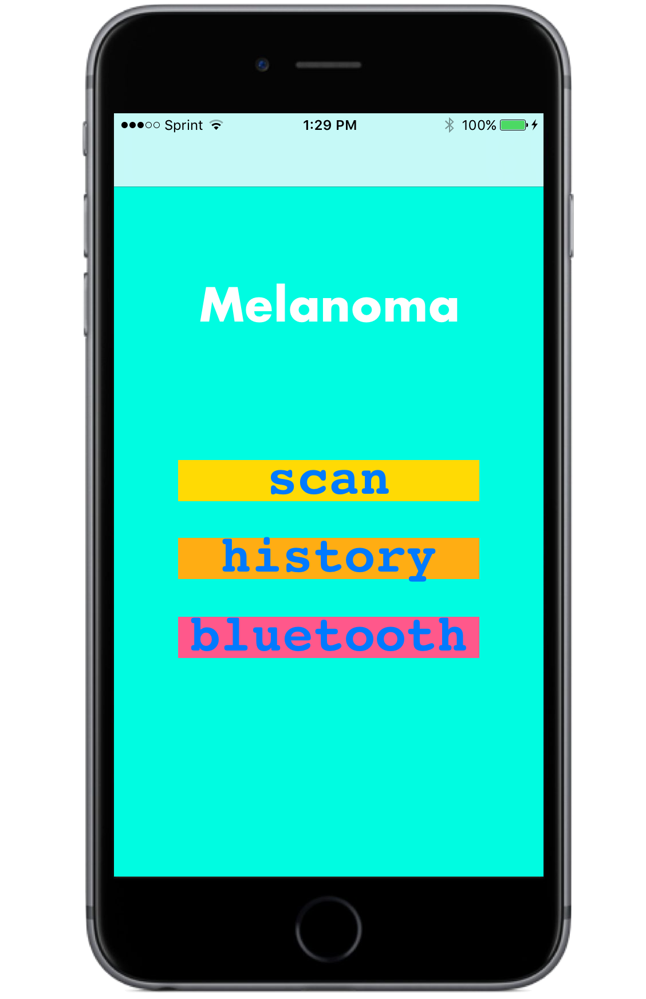
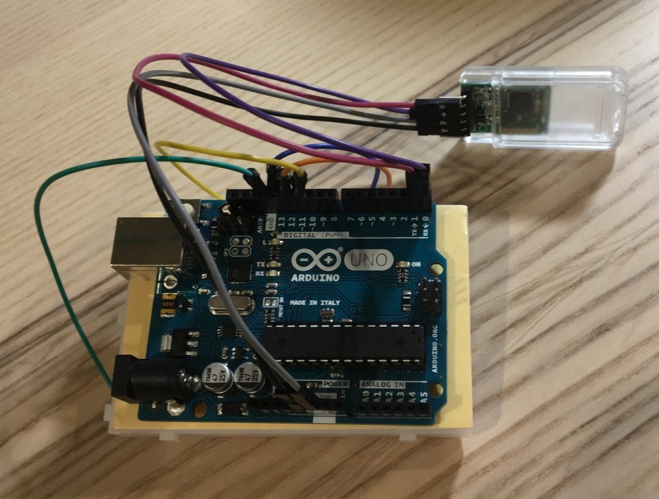
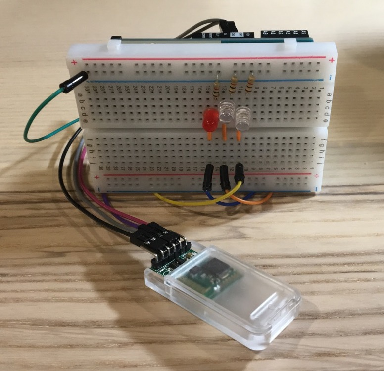
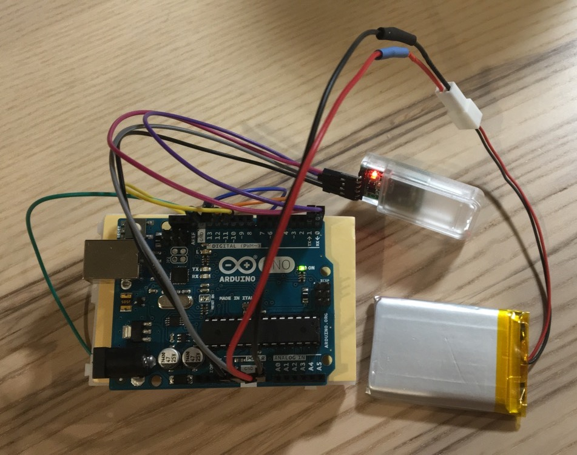

# Multispectral Imaging for Melanoma Diagnosis

**Johns Hopkins University Bio-Photonics Lab David Kleinberg**

~ *An affordable solution to noninvasive melanoma detection* ~

  
  

  

  App deployed on iPhone 6s & Melanoma main screen

  

  
  
  

  

  Device powered ON by 1000mAh lithium ion battery

